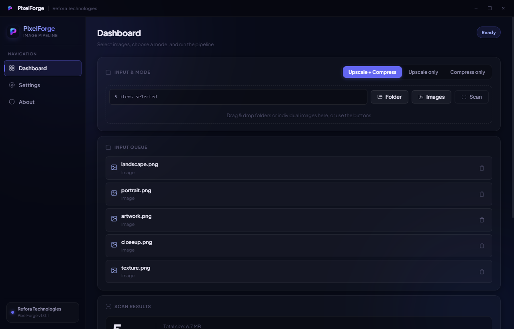
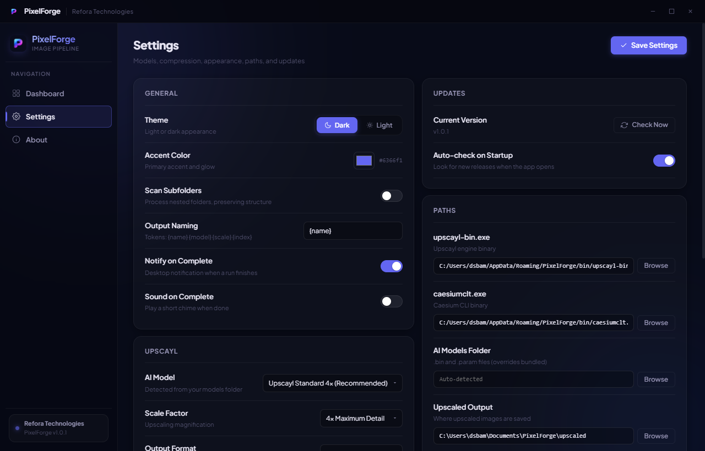
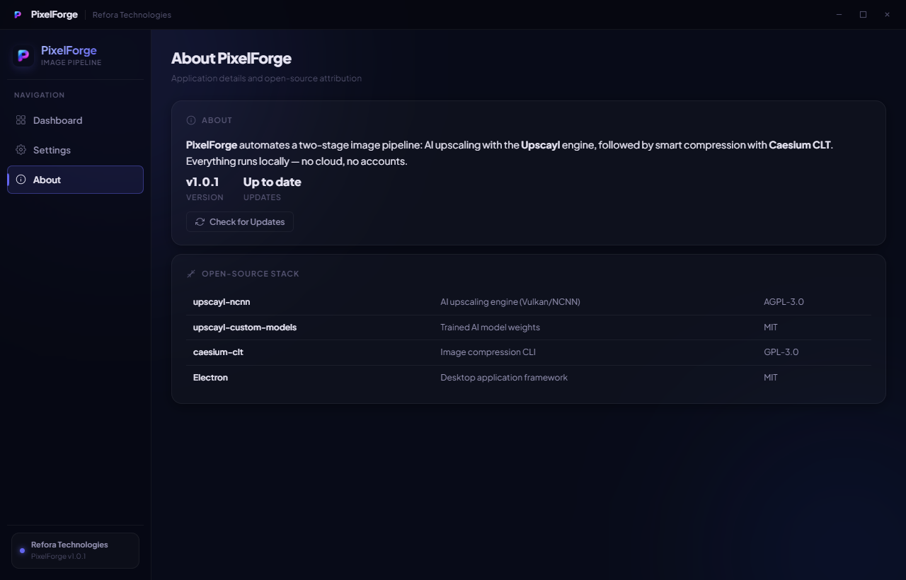

# PixelForge

> AI-powered batch image upscaling and compression for Windows. Free, offline, private.


[](https://github.com/refora-technologies/pixelforge/releases/latest)
[](https://github.com/refora-technologies/pixelforge/releases)

**[Website](https://pixelforge.reforatech.com)** · **[Download](https://github.com/refora-technologies/pixelforge/releases/latest)**

---

## What is PixelForge?

PixelForge is a Windows desktop app that automates a two-stage image enhancement pipeline:

1. **AI Upscaling** — Upscale images up to 4x using 7 bundled AI models, powered by [upscayl-ncnn](https://github.com/upscayl/upscayl-ncnn).
2. **Smart Compression** — Compress the upscaled output using [caesium-clt](https://github.com/Lymphatus/caesium-clt) without visible quality loss.

All processing is 100% local. No cloud, no accounts, and no internet required after the one-time dependency setup.



---

## Features

- **Pick a folder or individual images** — process an entire folder or hand-pick specific images from anywhere, with drag-and-drop support.
- **Three pipeline modes** — Upscale + Compress, Upscale only, or Compress only.
- **7 bundled AI models** — all included in the installer, no separate download needed.
- **GPU-accelerated** — Vulkan-powered inference via upscayl-ncnn (NVIDIA, AMD, Intel), with automatic priority for the dedicated GPU.
- **Batch processing with live progress** — exact per-image counters, elapsed time, and ETA.
- **Pause, resume, and cancel** — stop or hold a batch safely between images.
- **Input queue** — line up multiple folders and images in a single run.
- **Recursive scanning** — optionally include subfolders and preserve their structure in the output.
- **Before / after preview** — inspect results in a gallery with a side-by-side comparison slider.
- **Custom output naming** — rename outputs with templates such as `{name}`, `{model}`, `{scale}`.
- **Light and dark themes** with a customizable accent color.
- **Desktop notifications** when a batch finishes.
- **Built-in update checker** — checks GitHub for new releases and downloads them in-app.
- **100% offline and private** — zero telemetry, zero cloud, zero accounts.

---

## Screenshots

| Settings | About |
|---|---|
|  |  |

---

## Download

**[Download the latest release](https://github.com/refora-technologies/pixelforge/releases/latest)**

- Windows 10 / 11 (64-bit)
- Roughly 230 MB (includes all 7 AI models)
- No Upscayl installation required

On first launch, PixelForge downloads two small command-line tools (the upscayl engine and Caesium CLT, about 25 MB total) and verifies them before use. The AI models are already bundled with the installer.

---

## AI Models Included

| Model | Optimized For |
|---|---|
| Upscayl Standard 4x | General photography |
| Upscayl Lite 4x | Fast processing, lower VRAM |
| Ultra Sharp 4x | Maximum sharpness |
| Remacri 4x | Real-world photos |
| UltraMix Balanced 4x | Balanced output |
| Digital Art 4x | Illustrations and art |
| High Fidelity 4x | High-detail preservation |

---

## Open Source Stack

PixelForge is an automation layer built on outstanding open-source tools:

| Tool | License | Purpose |
|---|---|---|
| [upscayl-ncnn](https://github.com/upscayl/upscayl-ncnn) | AGPL-3.0 | AI upscaling engine (Vulkan/NCNN) |
| [upscayl-custom-models](https://github.com/upscayl/upscayl-custom-models) | MIT | Trained AI model weights |
| [caesium-clt](https://github.com/Lymphatus/caesium-clt) | GPL-3.0 | Image compression CLI |
| [Electron](https://github.com/electron/electron) | MIT | Desktop application framework |
| [electron-store](https://github.com/sindresorhus/electron-store) | MIT | Persistent settings storage |
| [extract-zip](https://github.com/maxogden/extract-zip) | BSD-2 | ZIP extraction for dependency setup |

Full attribution and license texts are included in every installation via the EULA screen.

---

## Building from Source

```bash
git clone https://github.com/refora-technologies/pixelforge.git
cd pixelforge
npm install
```

> Note: `src/models/` is not included in the repository (the files are roughly 180 MB, too large for GitHub).
> To run in development, copy your AI model files (`.param` and `.bin`) into `src/models/`.
> Models are available at [upscayl-custom-models](https://github.com/upscayl/upscayl-custom-models/tree/main/models).

```bash
# Run in development mode
npm start

# Build the Windows installer (requires model files in src/models/)
npm run build
```

---

## License

MIT (c) 2026 [Refora Technologies](https://reforatech.com)

This project is MIT licensed. Third-party binaries (upscayl-ncnn, caesium-clt) are distributed
under their respective licenses (AGPL-3.0 and GPL-3.0). See [LICENSE](LICENSE) and the
[EULA](build/license.txt) for full attribution.

---

<div align="center">
  <sub>A product of <a href="https://reforatech.com">Refora Technologies</a> · <a href="https://pixelforge.reforatech.com">pixelforge.reforatech.com</a></sub>
</div>
