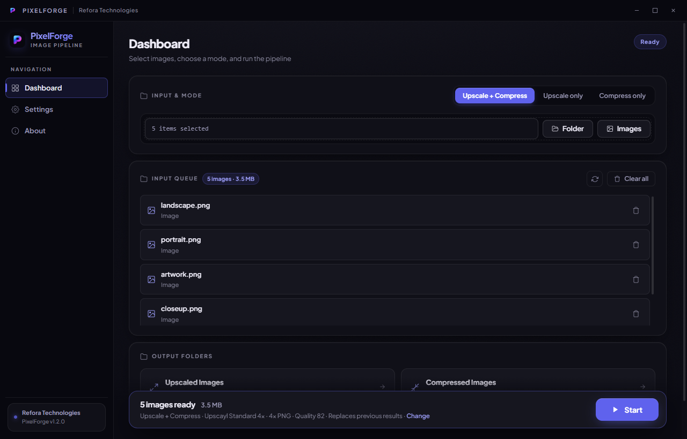
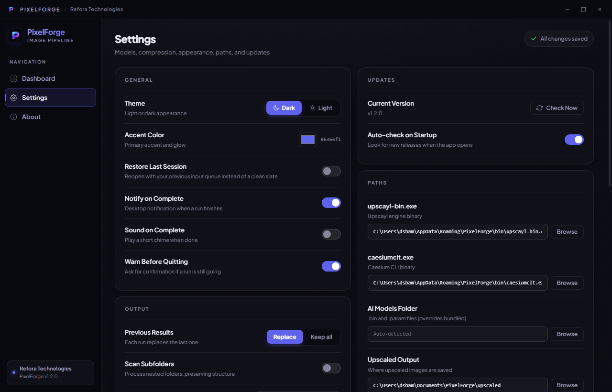
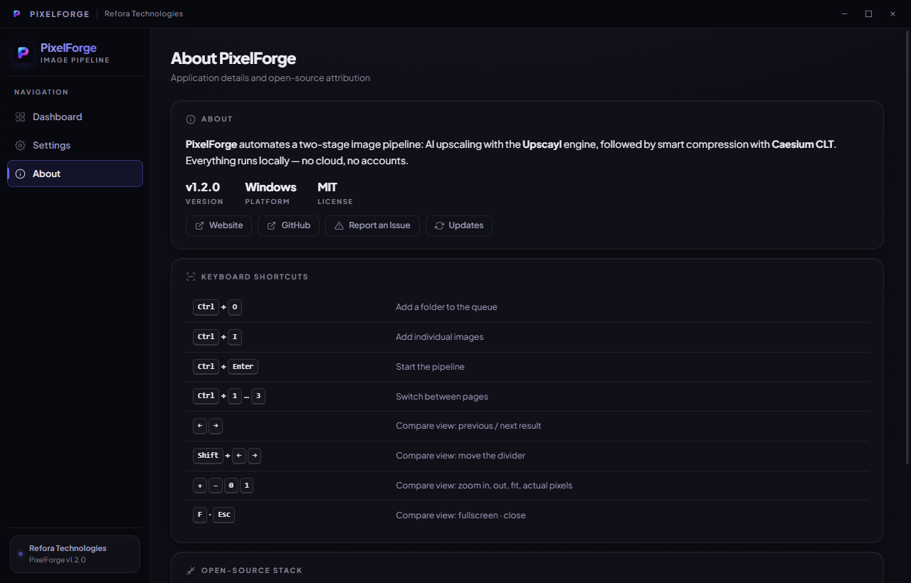

# PixelForge

> AI-powered batch image upscaling and compression for Windows. Free, offline, private.


[](LICENSE)
[](https://github.com/refora-technologies/pixelforge/releases/latest)
[](https://github.com/refora-technologies/pixelforge/releases)

**[Website](https://pixelforge.reforatech.com)** · **[Download](https://github.com/refora-technologies/pixelforge/releases/latest)**

---

## What is PixelForge?

PixelForge is a Windows desktop app that automates a two-stage image enhancement pipeline:

1. **AI Upscaling** — Upscale images up to 4x using 7 bundled AI models, powered by [upscayl-ncnn](https://github.com/upscayl/upscayl-ncnn).
2. **Smart Compression** — Compress the upscaled output using [caesium-clt](https://github.com/Lymphatus/caesium-clt) without visible quality loss.

All processing is 100% local. No cloud, no accounts, and no internet required after the one-time dependency setup.



---

## Features

- **Pick a folder or individual images** — process an entire folder or hand-pick specific images from anywhere, with drag-and-drop support.
- **Three pipeline modes** — Upscale + Compress, Upscale only, or Compress only.
- **7 bundled AI models** — all included in the installer, no separate download needed.
- **GPU-accelerated** — Vulkan-powered inference via upscayl-ncnn (NVIDIA, AMD, Intel), with automatic priority for the dedicated GPU.
- **Batch processing with live progress** — an always-visible run bar with per-image counts, ETA, and progress on the Windows taskbar.
- **Pause, resume, and cancel** — pause takes effect within seconds; a cancelled run leaves nothing half-written.
- **Keeps going past bad images** — a corrupt file is reported and skipped instead of stopping the whole batch.
- **Input queue** — line up multiple folders and images in a single run, and remove any of them individually.
- **Keep or replace previous results** — send every run to its own timestamped folder, or replace the last run. Replace only ever removes files PixelForge created: anything else in the output folder is never touched, and results never overwrite each other.
- **Checks the space first** — before a run, PixelForge estimates how much it will write and warns you if the output drive may not have room.
- **Recent runs** — the dashboard lists your latest runs with what they did, and opens any run's output in one click.
- **Recursive scanning** — optionally include subfolders and preserve their structure in the output.
- **Before / after preview** — a comparison slider with zoom, pan and 1:1 actual-pixel view, fullscreen, and next / previous through every result.
- **Custom output naming** — rename outputs with templates such as `{name}`, `{model}`, `{scale}`.
- **Light and dark themes** with a customizable accent colour — text stays readable (WCAG AA) whatever colour you pick.
- **Settings save as you go** — paths are checked before they are saved, so a mistake is caught in Settings rather than mid-run.
- **Keyboard shortcuts** for adding inputs, starting a run, and moving between pages.
- **Desktop notifications** when a batch finishes.
- **One-click updates** — PixelForge checks GitHub for new releases, verifies each download against its published SHA-256 checksum, and installs it with a single "Restart to update". Updates that can't be verified are refused.
- **100% offline and private** — zero telemetry, zero cloud, zero accounts.

---

## Screenshots

| Settings | About |
|---|---|
|  |  |

---

## Download

**[Download the latest release](https://github.com/refora-technologies/pixelforge/releases/latest)**

- Windows 10 / 11 (64-bit)
- Roughly 275 MB (includes all 7 AI models)
- No Upscayl installation required

On first launch, PixelForge downloads two small command-line tools (the upscayl engine and Caesium CLT, about 25 MB total) and verifies them before use. The AI models are already bundled with the installer.

---

## AI Models Included

| Model | Optimized For |
|---|---|
| Upscayl Standard 4x | General photography |
| Upscayl Lite 4x | Fast processing, lower VRAM |
| Ultra Sharp 4x | Maximum sharpness |
| Remacri 4x | Real-world photos |
| UltraMix Balanced 4x | Balanced output |
| Digital Art 4x | Illustrations and art |
| High Fidelity 4x | High-detail preservation |

---

## Open Source Stack

PixelForge is an automation layer built on outstanding open-source tools:

| Tool | License | Purpose |
|---|---|---|
| [upscayl-ncnn](https://github.com/upscayl/upscayl-ncnn) | AGPL-3.0 | AI upscaling engine (Vulkan/NCNN) |
| [upscayl-custom-models](https://github.com/upscayl/upscayl-custom-models) | MIT | Trained AI model weights |
| [caesium-clt](https://github.com/Lymphatus/caesium-clt) | GPL-3.0 | Image compression CLI |
| [Electron](https://github.com/electron/electron) | MIT | Desktop application framework |
| [electron-store](https://github.com/sindresorhus/electron-store) | MIT | Persistent settings storage |
| [extract-zip](https://github.com/maxogden/extract-zip) | BSD-2 | ZIP extraction for dependency setup |

PixelForge downloads upscayl-ncnn and caesium-clt from their official releases on first launch and runs them unmodified, as separate programs. Full attribution and license notices are shown on the license screen of every installer ([build/license.txt](build/license.txt)).

---

## Building from Source

Requires Node.js 22.12 or newer.

```bash
git clone https://github.com/refora-technologies/pixelforge.git
cd pixelforge
npm install
```

`npm install` also turns on a pre-commit check (lint, type-check and the fast test suites, a few seconds).

> Note: `src/models/` is not included in the repository (the files are roughly 180 MB, too large for GitHub).
> To run in development, copy your AI model files (`.param` and `.bin`) into `src/models/`.
> Models are available at [upscayl-custom-models](https://github.com/upscayl/upscayl-custom-models/tree/main/models).

```bash
# Run in development mode
npm start

# Build the Windows installer (requires model files in src/models/)
npm run build

# Run the test suites (the pipeline tests use the engine binaries the app installs)
npm test

# Before publishing: walk the installer pages and verify the release through the real updater
npm run verify:installer
npm run verify:release

# Install an older release, then update it the way "Restart to update" does (on a PC without PixelForge installed)
npm run verify:update-install -- -Old path\to\older\PixelForge-Setup.exe

# After publishing: check the live release the way installed copies will see it
npm run verify:published -- --download
```

---

## License

PixelForge is free software, licensed under the [GNU General Public License v3.0 or later](LICENSE) (GPL-3.0-or-later).
© 2026 [Refora Technologies](https://reforatech.com).

You may use it for any purpose, including commercial work, share it, and change it. If you share a changed
version, it must also be under the GPL, with its source code available.

Versions up to and including 1.2.0 were released under the MIT License.

The open-source components PixelForge uses keep their own licenses (see [Open Source Stack](#open-source-stack)
and [build/license.txt](build/license.txt)).

---

<div align="center">
  <sub>A product of <a href="https://reforatech.com">Refora Technologies</a> · <a href="https://pixelforge.reforatech.com">pixelforge.reforatech.com</a></sub>
</div>
